# 用SHAP来解释你的机器学习模型
### [原文链接](https://bjlkeng.github.io/posts/model-explanability-with-shapley-additive-explanations-shap/#id1)

---

**机器学习模型常常被指责一大不足便是，它本质上是一个黑箱子。输入数据，输出预测结果，仅此而已。但是又怎么会有别的方式呢？当我们的机器模型是一个高维的非线性模型，而且模型在很高的维度有交互时 (如DNN)，一个简单的解释显然是不足以满足我们需求的。事实证明，沿着机器学习的的可解释性这条路线走下去，有一条有趣的（和实用的）研究线。**

**本篇文章将深入探讨近3年发表的一种新的可解释机器学习模型，SHapely Additive exPlanations（或SHAP）。它建立在之前整个可解释机器学习模型的工作基础上，提供了一个统一的可解释模型框架，并与模型一起提出了一个使用沙普利值 (shapley value) 的解释角度。本文将介绍关于SHAP的感性认识、数学原理以及它是如何工作的。**

## 沙普利值与合作游戏
### 合作游戏
想象一下，你正在参加一个真人秀节目，你和另外两位玩家被困在一个荒岛上。你们所有人在岛上呆的时间越长，你们赚的钱就越多。因此你们需要一起努力，才能使你们的回报最大化。显然，你的回报直接取决于你和谁在一起。在这种情况下，你当然想选择两个更适合在荒岛生存的人一起，但如何选择呢？例如，你可能想选择一个有丰富生存能力经验的人，他们显然会对更好的结果有很大的贡献。另一方面，你可能不想选择像我这样大部分空闲时间都在室内对着电脑的人，我可能完全是副作用的。从本质上讲，我们要回答下面的两个问题。

1.  每个人对生存更久的这个目标的贡献度是什么样的？即如果游戏结束，每个人应该分到的奖金是多少？
2.  对于给定的一组玩家，什么样的预测结果是合理的(可以在荒岛上生存多久)？

这实质上是博弈论中的合作博弈问题（这与大多数人熟悉的传统博弈论中的非合作博弈不同）。正式的表达方式为:

合作博弈是指，存在个玩家和一个价值函数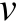，该价值函数将每一个玩家子集都映射到了对应的价值上。数学表达式为：

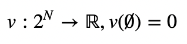

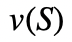函数描述了对于玩家子集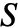的总预期的报酬。咱们再看回荒岛求生的例子，显然，在你的荒岛求生联盟中，加入一个有丰富生存能力经验的人比加入我对于函数会有更好的结果(报酬)。也就是说，该函数回答了我们提出的第二个问题，对于给定的一组玩家，什么样预测结果是合理的？

接着我们来思考第一个问题，即对于最终的报酬，如何分配才能使各个玩家都是公平的？从直觉上来说，有丰富生存能力经验的人比我所要获得的报酬应该要多得多，但是究竟应该多多少呢？是否存在“唯一的”公平的分配策略呢？答案就在沙普利值里面。

### 沙普利值(Shapley Values)
沙普利值(Shapley value, 为了纪念Lloyd Shapley)正是上述问题的解决方案，它被表示为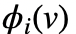，其中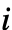表示第个玩家，是我们前面提到的值函数，沙普利值的定义如下:

![$$\phi_i(v) = \frac{1}{N}\Sigma_{S\subseteq N\backslash\{i\}} {\begin{pmatrix} N-1\\ S\end{pmatrix}}^{-1}(v(S\cup\{i\})-v(S))= \frac{1}{所有玩家}\Sigma_{不含i的玩家组成的玩家子集}\frac{i对子集的边际贡献}{除去i以后剩余玩家可以组成的子集的数目}= \Sigma_{S\subseteq N\backslash\{i\}}\frac{|S|!(N-|S|-1)!}{N!}[v(S\cup\{i\})-v(S))]$$](./pics/eq2.png)
 
 
 这个定义非常的直观，即在每一种可能的情况下，计算每个玩家$$i$$的平均边际贡献。从式中可以看出，是把包含玩家的子集所产生的收益，平均到了每一个包含的子集上。我们平常可能更多见到的是后面一个式子，它是将组合数拆开化简的结果。
 
 沙普利值十分完美，因为它是唯一具有以下属性的贡献值分配方案:
 
 1. **效率性(Efficiency)**: 所有玩家的沙普利值之和等于该N个玩家价值函数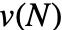的取值。

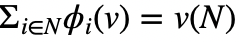
 
 2. **对称性(Symmetry)**: 如果对于和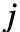两个玩家满足以下等式:
 
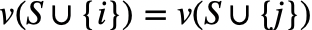
 
 则对于每一个既不包含也不包含的和的子集，都有
 
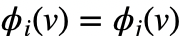
 
 3. **线性(可加性)(Linearity)**: 对于集合中的每一个玩家，它对于两个不同合作游戏的贡献价值函数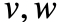是可加的，即:

 
 4. **缺失值不敏感性(Null player)**: 对于一个空玩家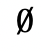，有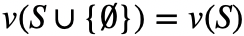，因此有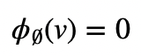，即空玩家对于合作游戏的贡献度是0。

 显然以上四点对于一个贡献值分配方案是必须满足的:
 
 - **效率性**: 我们期望每个玩家贡献值之和是整个玩家集合所能获得的回报；
 - **对称性**: 如果两个人对于游戏的贡献是一样的，我们期望他们所得到的回报是一样的；
 - **可加性**: 如果一个游戏是由两个独立的子游戏组成，我们希望游戏的总回报是两个子游戏的回报的和；
 - **缺失值不敏感性**: 如果一个玩家什么都不贡献，那么他所得到的回报应该是0。

 接下来我们看两个具体的例子：
