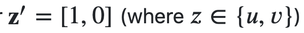
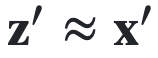

# 用SHAP来解释你的机器学习模型
### [原文链接](https://bjlkeng.github.io/posts/model-explanability-with-shapley-additive-explanations-shap/#id1)

---

**机器学习模型常常被指责一大不足便是，它本质上是一个黑箱子。输入数据，输出预测结果，仅此而已。但是又怎么会有别的方式呢？当我们的机器模型是一个高维的非线性模型，而且模型在很高的维度有交互时 (如DNN)，一个简单的解释显然是不足以满足我们需求的。事实证明，沿着机器学习的的可解释性这条路线走下去，有一条有趣的（和实用的）研究线。**

**本篇文章将深入探讨近3年发表的一种新的可解释机器学习模型，SHapely Additive exPlanations（或SHAP）。它建立在之前整个可解释机器学习模型的工作基础上，提供了一个统一的可解释模型框架，并与模型一起提出了一个使用沙普利值 (shapley value) 的解释角度。本文将介绍关于SHAP的感性认识、数学原理以及它是如何工作的。**

## 沙普利值与合作游戏
### 合作游戏
想象一下，你正在参加一个真人秀节目，你和另外两位玩家被困在一个荒岛上。你们所有人在岛上呆的时间越长，你们赚的钱就越多。因此你们需要一起努力，才能使你们的回报最大化。显然，你的回报直接取决于你和谁在一起。在这种情况下，你当然想选择两个更适合在荒岛生存的人一起，但如何选择呢？例如，你可能想选择一个有丰富生存能力经验的人，他们显然会对更好的结果有很大的贡献。另一方面，你可能不想选择像我这样大部分空闲时间都在室内对着电脑的人，我可能完全是副作用的。从本质上讲，我们要回答下面的两个问题。

1.  每个人对生存更久的这个目标的贡献度是什么样的？即如果游戏结束，每个人应该分到的奖金是多少？
2.  对于给定的一组玩家，什么样的预测结果是合理的(可以在荒岛上生存多久)？

这实质上是博弈论中的合作博弈问题（这与大多数人熟悉的传统博弈论中的非合作博弈不同）。正式的表达方式为:

合作博弈是指，存在个玩家和一个价值函数，该价值函数将每一个玩家子集都映射到了对应的价值上。数学表达式为：

函数描述了对于玩家子集的总预期的报酬。咱们再看回荒岛求生的例子，显然，在你的荒岛求生联盟中，加入一个有丰富生存能力经验的人比加入我对于函数会有更好的结果(报酬)。也就是说，该函数回答了我们提出的第二个问题，对于给定的一组玩家，什么样预测结果是合理的？

接着我们来思考第一个问题，即对于最终的报酬，如何分配才能使各个玩家都是公平的？从直觉上来说，有丰富生存能力经验的人比我所要获得的报酬应该要多得多，但是究竟应该多多少呢？是否存在“唯一的”公平的分配策略呢？答案就在沙普利值里面。

### 沙普利值(Shapley Values)
沙普利值(Shapley value, 为了纪念Lloyd Shapley)正是上述问题的解决方案，它被表示为，其中表示第个玩家，是我们前面提到的值函数，沙普利值的定义如下:

![$$\phi_i(v) = \frac{1}{N}\Sigma_{S\subseteq N\backslash\{i\}} {\begin{pmatrix} N-1\\ S\end{pmatrix}}^{-1}(v(S\cup\{i\})-v(S))= \frac{1}{所有玩家}\Sigma_{不含i的玩家组成的玩家子集}\frac{i对子集的边际贡献}{除去i以后剩余玩家可以组成的子集的数目}= \Sigma_{S\subseteq N\backslash\{i\}}\frac{|S|!(N-|S|-1)!}{N!}[v(S\cup\{i\})-v(S))]$$](./pics/eq2.png)
 
 
 这个定义非常的直观，即在每一种可能的情况下，计算每个玩家的平均边际贡献。从式中可以看出，是把包含玩家的子集所产生的收益，平均到了每一个包含的子集上。我们平常可能更多见到的是后面一个式子，它是将组合数拆开化简的结果。
 
 沙普利值十分完美，因为它是唯一具有以下属性的贡献值分配方案:
 
 1. **效率性(Efficiency)**: 所有玩家的沙普利值之和等于该N个玩家价值函数的取值。

 
 2. **对称性(Symmetry)**: 如果对于和两个玩家满足以下等式:
 

 
 则对于每一个既不包含也不包含的和的子集，都有
 

 
 3. **线性(可加性)(Linearity)**: 对于集合中的每一个玩家，它对于两个不同合作游戏的贡献价值函数是可加的，即:

 
 4. **缺失值不敏感性(Null player)**: 对于一个空玩家，有，因此有，即空玩家对于合作游戏的贡献度是0。

 显然以上四点对于一个贡献值分配方案是必须满足的:
 
 - **效率性**: 我们期望每个玩家贡献值之和是整个玩家集合所能获得的回报；
 - **对称性**: 如果两个人对于游戏的贡献是一样的，我们期望他们所得到的回报是一样的；
 - **可加性**: 如果一个游戏是由两个独立的子游戏组成，我们希望游戏的总回报是两个子游戏的回报的和；
 - **缺失值不敏感性**: 如果一个玩家什么都不贡献，那么他所得到的回报应该是0。

**接下来我们看两个具体的例子：**

---

> ### **例1: 手套问题:**
>
> 假设我们现在有一个游戏，玩家手上有一只左手手套或者右手手套，该游戏的目的是组成一对手套。现在我们的游戏有3个人，即={1,2,3}，其中玩家1和2有一只左手手套，玩家3有一只右手手套。价值函数对所有能组成一对手套的子集定义得分为1，否则为0:
> 
> 
> 现在我们来看一看每一位玩家对于得分的边际贡献(marginal contribution)都是多少。首先计算所有含有玩家1的子集的价值函数。
> 
> 
> 再利用前面提到的沙普利值的计算公式:
> 
> 
> 再利用沙普利值的对称性，玩家1和玩家2的沙普利值应当是相等的，即:
>  
> 
> 再利用沙普利值的有效性属性(efficiency)，我们可以得出玩家3的沙普利值为:
>  
> 
> 正如我们所预期的那样，玩家3拥有所有人中唯一的一只右手手套，因此他所得到的利润分成是其余两个玩家的四倍。

---
---

> ### **例2: 老板与员工**
>
> 假设有一个企业的老板，表示为，老板为企业提供了初始的投资(启动资金)，如果没有启动资金，则企业也就不会有收益，同时，该企业还雇用了个工人，表示为。假设每个工人对于最后企业的利润所得都贡献了，我们来算一下，如果依照沙普利值，老板和每个工人各能分到利润的多少。
>
> 该问题的个玩家可以表示为:
> 
> 
> 价值函数可以表示为：
> 
> 
> 其中表示子集中有个工人。
> 
> 现在我们来计算老板的沙普利值：
> 
> 
> 同样的，根据效率性和对称性，其余个工人得到的报酬也是，即每位工人能拿到的利润，换句话说，每个工人都把自己应得利润的一半 "贡献 "给企业主。
> 
> 不过这真的公平吗？从沙普利值的角度来看似乎是这样的。然而，在通常的企业社会里，投资者/企业主获得的利润远远超过了一半，真是个值得深思的问题。

---

### 利用沙普利值来解释机器学习的特征(feature)
#### 特征可加模型
我们首先需要弄明白的一点是，什么叫做模型的可解释性？比如咱们用简单的线性回归为例:

这样的线性回归模型可能就是咱们对于可解释模型的最直观感性的认识：每一个变量都是独立，可加的，同时对于每一个，我们都能用一个系数来代表对于结果的贡献。可是对于更复杂的模型，我们又该作何理解呢？即使我们仍然使用线性模型，但是一旦引入特征交互，如以下式子，则每个贡献度就很难说清楚了:

在上面式子这种情况下，我们难以分辨出对于最后结果的贡献值是多少，因为我们总希望我们的变量是独立的，可加的。如果不是，确实很难去“解释”我们的机器学习模型。

如果我们从简单一点的地方开始，不再尝试去解释整个模型，而是去解释每一个数据点，情况又会是怎样呢？这被称为局部可解释性(local interpretable method)。当然，我们需要设立一些前提条件：1) 我们可以通过最简单的线性模型来解释一个数据点；2）相似的模型所产生的解释也是相似的。接下来我将提出问题假设，并引出一些定义：

所谓的局部可解释性方法，旨在解释一个预测模型在某一个点的结果。而当我们真正在解释一个数据点的时候，特征(feature)的取值多少其实并不重要，我们所关注的是该特征的存在对于最后预测结果的贡献有多大。为此，我们定义一个简化输入的二进制向量，该向量代表我们是否要包含该特征对整体预测的贡献 (类似于我们上面的合作游戏)。同时，我们有一个映射函数，该映射函数将二进制的向量映射到与点相等的值上面。值得注意的是，该映射函数![](./pics/h.png对于每一个数据点都是独有的，即每一个数据点都有一个自身不同的映射函数。用文字写出来有点混乱，所以我们来看一个例子，应该可以澄清这个概念。

> ### **例3：简化输出**
> 
> 考虑一个简单的线性交互模型，有两个输入,
> 
> 
> 我们来看其中两个数据点:
> 
> 
> 假设我们想看看对 这两个数据点的影响。我们会利用向量 ，并利用各自的映射函数 来映射回各自点的原始值。
>  
> 
> 其中我们用 "n/a "表示缺失的值（我们稍后会讲到）。正如我们所看到的，这种形式化允许我们谈论是否应该包含一个特征以及它们的相等的取值。

现在我们有了这些定义，我们最终的目的是要建立一个新的解释模型， ，使得无论时，都有。特别地，我们还希望该可解释模型可以和线性模型一样简单，因此，我们可以将定义如下: 

其中，是简化后特征的数目

该式子与我们如何解释单个数据点的前提是一致的：各个特征独立，且满足可加性。接下来，我们看看还能在该映射方法中保留一些什么令人期待的理想属性。

#### 理想属性与沙普利值
